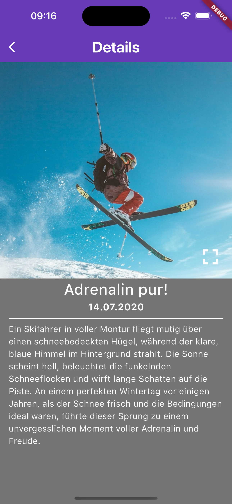
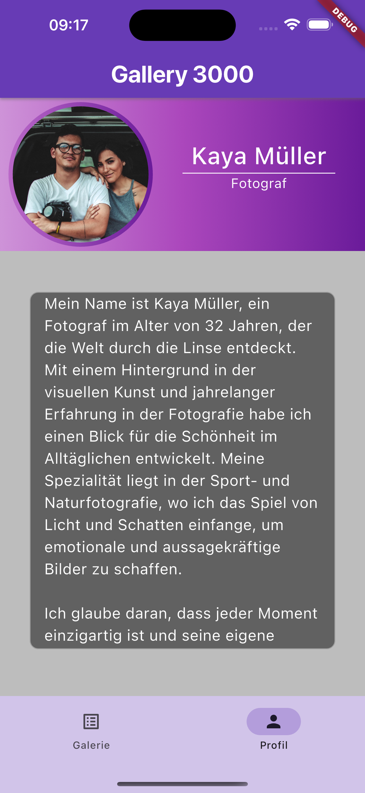

# gallery_app_3000

   

## Eine kleine Bildergallerie App

Die Aufgabe war, aus gegebenen Bildern und dem Text über den Fotograf, eine App zu bauen. 

Anforderungen:
 - Alle Bilder in einer Gridview
 - Ein Details Screen zu jedem Bild
 - Die Profilseite für den Fotograf

Zusätzlich habe ich eine Fullscreenansicht für die Bilder eingebaut.  
